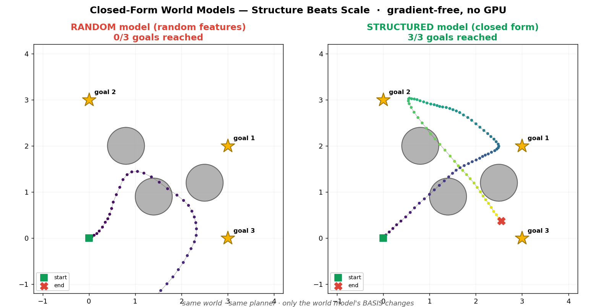

# Structured World Models — *Structure Beats Scale*

### Oracle-first evaluation of structured, gradient-free world models.


A small, fully-measured study of **gradient-free world models** for model-based control.
No backprop, no neural net, no GPU — just closed-form least squares + sampling-based planning,
on a laptop CPU.

**Precise claim (scoped).** On *synthetic, closed-form* world models, a structured basis beats random
features for **multi-step prediction**; in **closed-loop control** the advantage appears only past a
*measured* regime boundary (dimension × replanning frequency — see §10). Every number here is
reproducible (`make all`, or the frozen outputs in [`results/`](results/)).

## Quick result

```text
$ python3 agent_canon.py
random model      : 0/3
structured model  : 3/3
oracle            : 3/3
```

The world model is the only thing that changes between the three rows. Same planner, same task.

> **One-step R² is not enough to judge a world model. The real test is the multi-step rollout —
> then the agent, controlled with a planner validated by an oracle.**



*Same world, same planner — only the **basis** of the world model changes. Left: random features
wander (0/3 goals). Right: the structured model reaches all 3 goals (3/3).*

---

## 1. Summary

A world model learns `state + action → next state`. The common choice — **random Fourier features**
on `[state, action]` — gets an excellent **one-step R²** but **drifts over multi-step rollouts**,
and the drift gets worse with dimension. The fix is **structure**: impose the integrator
`p' = p + v'·dt`, learn only the velocity change `Δv`, on an **invariant/physical basis** instead of
random features. This is solved in **closed form** (one `solve`, zero gradient) and **scales to 64-D**.

```python
p' = p + v'·dt                 # imposed integrator (not learned)
Δv = Φ(p, v, a) · W            # only the velocity change is learned
Φ  = [1, p, v, a, v·‖v‖]       # invariant basis (not random)
W  = (ΦᵀΦ + λI)⁻¹ ΦᵀΔv         # closed form, gradient-free
```

Two rules came out of this, both verified by the benchmarks below:

1. **Structure > random features** — decisive for prediction (long horizon, high dimension).
2. **Oracle first** — validate the *planner* with the true-physics oracle **before** judging any
   learned model. An oracle failure is a planner bug, not a model bug.

---

## 2. The initial problem

A gradient-free agent (learned world model + sampling-based planner) was stuck at **0/3 goals** on a
2-D point-mass tour (drag + current, 3 obstacles). The world model had **R² = 0.97** at one step —
yet the agent failed. Diagnosis (`agent_canon.py`): the **planner was fine** (the oracle reaches
**3/3**); the **random-feature model's rollout drifted**, so the imagined future the planner optimized
did not match reality.

```
$ python3 agent_canon.py
random model      : 0/3
structured model  : 3/3        # R² = 1.0000, matches the oracle exactly
oracle            : 3/3
```

The scaling experiments make the failure mode explicit:

| world dim | random-feature R² (1-step) | more K & N fixes it? |
|---|---|---|
| 4-D  | 0.97 | — |
| 8-D  | 0.93 | — |
| 16-D | 0.86 | **no — plateaus ≈ 0.88** (`world_scale2.py`) |
| 32-D | 0.72 | curse of dimensionality |

The structured model, by contrast, reaches **R² = 1.0 up to 64-D** (`world_scale_solution.py`), and
even a *generic* library + plain ridge does (`world_scale_robust.py`).

---

## 3. Bench 1 — Oracle first  (`planner_cem_solution.py`)

Before judging any learned model, check that the **planner** (CEM — cross-entropy method, with
receding-horizon warm-start) can solve each task **with the true physics**.

```
benchmark            | result (oracle)                | verdict
Pendulum             | 100% upright at the end        | OK
MountainCar          | x_max = +0.60 (flag at 0.45)   | OK
CartPole             | 200/200 steps balanced         | OK
High-D reach (12-D)  | min distance to target = 0.83  | OK   (threshold calibrated to oracle)
```

This bench **earned its keep**: the 12-D reach initially **failed even with the oracle** — a
planner/threshold limit, not a model limit. Without "oracle first" we would have wrongly blamed the
learned model.

---

## 4. Bench 2 — Model quality, no agent  (`model_quality.py`)

One-step R² is misleading. What matters for planning is the **multi-step rollout error**.

| benchmark | model | R² (1-step) | rollout@10 | rollout@20 | **rollout@50** |
|---|---|---|---|---|---|
| Pendulum | random | 1.0000 | 0.27 | 1.76 | **5.49** |
| Pendulum | **structured** | 1.0000 | 0.09 | 0.17 | **1.55** |
| CartPole | random | 1.0000 | 0.04 | 0.47 | **4.08** |
| CartPole | **structured** | 1.0000 | 0.00 | 0.05 | **0.57** |
| **High-D (12-D)** | random | **0.9905** | 1.13 | 2.27 | **8.95** |
| **High-D (12-D)** | **structured** | **1.0000** | 0.00 | 0.00 | **0.000** |
| MountainCar | random | 1.0000 | 0.02 | 0.05 | 0.11 |
| MountainCar | structured | 0.9999 | 0.05 | 0.11 | 0.26 |

The High-D row is the headline: random features look perfect at one step (R² = 0.99) but their
rollout **drifts to 8.95**, while the structured model stays at **0.000**. One-step R² hid everything.

---

## 5. Bench 3 — Agents, closed loop  (`agent_cem_benchmark.py`)

Now run the full agents with the **validated** planner. Verdict is automatic
(`planner_fail` / `model_fail` / success).

```
benchmark            | random | structured | oracle | verdict
Pendulum             |   OK   |     OK     |   OK   | success (low-dim parity)
MountainCar          |   OK   |     OK     |   OK   | success (low-dim parity)
CartPole             |   OK   |     OK     |   OK   | success (low-dim parity)
High-D reach (12-D)  |   OK   |     OK     |   OK   | success (low-dim parity)
```

---

## 6. Key result

- **Open loop (prediction):** structure wins decisively, and the gap grows with dimension
  (High-D: rollout@50 **8.95 → 0.000**).
- **Closed loop (control) at these dims:** **parity** — both models solve all four tasks.
- The structured model is **closed-form, gradient-free**, matches the **oracle exactly** where it
  spans the dynamics (R² = 1.0), and **scales to 64-D** where random features plateau at ≈ 0.88.

---

## 7. Important caveat

**In closed loop with frequent replanning, a CEM planner compensates for much of the random model's
drift.** Receding-horizon control only needs *short-horizon* accuracy, which random features have at
moderate dimension — so they keep up. **The structured model's advantage becomes decisive as horizon,
dimension, or action commitment grow.** This is exactly why bench 2 (open loop) and bench 3 (closed
loop) disagree, and why both are needed.

---

## 8. What this proves

- One-step R² is an **insufficient** metric for a world model; multi-step rollout exposes the truth.
- A **structured, gradient-free, closed-form** world model matches an oracle and scales to 64-D.
- **Planner-vs-model confounding is real** and is removed by the *oracle-first* protocol.
- Sampling-based planning (**CEM + warm-start**) solves standard underactuated control tasks
  (pendulum swing-up, mountain-car, cart-pole) with **no gradient and no GPU**.

## 9. What this does not prove

- That structure beats random features **in closed-loop control under tight replanning** — there it
  is a **tie** at these dimensions (the open-loop win is masked). §10 now *measures* where the tie
  breaks: the gap opens at loose replanning and grows with dimension.
- It assumes a **basis that spans the dynamics**. When the true dynamics fall outside the library,
  a residual remains; `world_residual.py` shows a **local (kNN) residual** recovers it well while a
  random-feature residual barely helps.
- Results are measured on **simulated** systems; real hardware would need a richer library and
  cross-validation. *Measured, not promised.*

## 10. The regime boundary — closed-loop stress test  (`closed_loop_stress.py`)

The precise question: **at what dimension / replanning frequency do random features stop being good
enough in closed-loop control?** Goal: *locate* the boundary, not assume it. We sweep an n-D reach
world by dimension and by `c` = actions executed open-loop before replanning (action commitment;
`c=1` is tight MPC). Metric = min distance to target, averaged over 3 seeds; oracle is the reference.

```
open-loop drift (rollout@15):  random 0.96 (4D) → 1.76 (8D) → 2.56 (16D)   |  structured 0.000

closed-loop control (min dist to target, lower = better):
  dim   c    random  structured  oracle   verdict
  4D    1     0.25     0.25       0.25     random OK (parity)
  4D   15     0.30     0.08       0.08     random OK (parity)
  8D    1     0.75     0.64       0.64     random OK (parity)
  8D   15     0.98     0.60       0.60     random DEGRADES (+0.38)
  16D   1     1.11     0.98       0.98     random OK (parity)
  16D  15     1.54     1.05       1.05     random DEGRADES (+0.49)
```

**The boundary, measured.** The structured model tracks the oracle in *every* cell. Random features
keep up under **tight replanning** (small `c`), but once the controller **commits to many open-loop
steps** (`c = 15`) their drift is no longer corrected — and the gap **grows with dimension**
(+0.38 at 8-D → +0.49 at 16-D). So the closed-loop advantage of structure is real; it is gated by
replanning frequency and dimension, exactly as §7 predicted. (Full output: [`results/closed_loop_stress.txt`](results/).)

---

## Run it

```bash
pip install -r requirements.txt
make all          # compile + run every bench   (or run individual scripts below)

python3 agent_canon.py            # the headline: random 0/3 · structured 3/3 · oracle 3/3
python3 viz_trajectories.py       # regenerate the trajectory image

# the 3-bench "oracle first" protocol
python3 planner_cem_solution.py   # bench 1 — validate the planner with the oracle
python3 model_quality.py          # bench 2 — open-loop model quality (rollout@10/20/50)
python3 agent_cem_benchmark.py    # bench 3 — agents, closed loop, auto verdict

# scaling, out-of-library, and the regime boundary
python3 world_scale.py            # random features degrade with dimension
python3 world_scale2.py           # more K & N does not fix it (plateau ≈ 0.88 at 16-D)
python3 world_scale_solution.py   # structured model: R² = 1 up to 64-D
python3 world_scale_robust.py     # generic library + ridge still works; SINDy selection is tricky
python3 world_residual.py         # out-of-library term: global structure + local residual
python3 closed_loop_stress.py     # §10 — the regime boundary (dim × replanning frequency)
```

Frozen outputs of every script live in [`results/`](results/) (regenerate with `make results`).

## Repository layout

| file | role |
|---|---|
| `benchlib.py` | shared library: dynamics, models (structured / random / oracle), CEM planner |
| `agent_canon.py` | the canonical agent — `random 0/3 · structured 3/3 · oracle 3/3` |
| `viz_trajectories.py` | the trajectory figure |
| `planner_cem_solution.py` | bench 1 — oracle-first validation |
| `model_quality.py` | bench 2 — open-loop model quality |
| `agent_cem_benchmark.py` | bench 3 — agents, closed loop |
| `world_scale*.py`, `world_residual.py` | the scaling and out-of-library experiments |
| `closed_loop_stress.py` | §10 — closed-loop regime boundary (dimension × replanning) |
| `Makefile` · `.github/workflows/ci.yml` | one-command runs + CI (compile & reproduce on every push) |
| `results/` | frozen stdout of every script |

## License

MIT — see [LICENSE](LICENSE).
